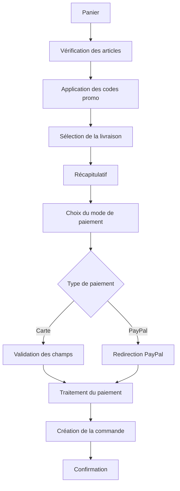

# Guide d'Intégration des Paiements - R&G

## Vue d'ensemble

Ce document décrit le système de paiement intégré dans la boutique R&G, incluant les intégrations PayPal et Stripe, la gestion des erreurs, et les bonnes pratiques de sécurité.

## Architecture du Système de Paiement

### Composants Principaux

1. **Interface de Paiement** (`pages/panier.html`)
   - Modal de paiement avec sélection de méthode
   - Formulaires de saisie sécurisés
   - Validation côté client

2. **Gestionnaire de Commandes** (`scripts/orders.js`)
   - Création et suivi des commandes
   - Génération de numéros de commande uniques
   - Gestion des statuts de commande

3. **Système d'Authentification** (`scripts/auth.js`)
   - Gestion des utilisateurs connectés
   - Historique des commandes par utilisateur
   - Adresses de livraison sauvegardées

4. **Codes Promotionnels** (`scripts/promo.js`)
   - Validation et application de remises
   - Support des réductions pourcentage et montant fixe
   - Conditions d'utilisation (montant minimum, validité)

## Méthodes de Paiement Supportées

### 1. Paiement par Carte Bancaire (Stripe)

#### Configuration Recommandée

```javascript
// Configuration Stripe (simulation)
const stripeConfig = {
    publishableKey: 'pk_test_...',
    currency: 'eur',
    supportedCardBrands: ['visa', 'mastercard', 'amex'],
    locale: 'fr'
};
```

#### Implémentation Réelle

Pour une implémentation en production, remplacez la simulation par :

```javascript
// Charger Stripe.js
const stripe = Stripe('pk_test_...');
const elements = stripe.elements();

// Créer les éléments de carte
const cardElement = elements.create('card', {
    style: {
        base: {
            fontSize: '16px',
            color: '#424770',
            '::placeholder': {
                color: '#aab7c4',
            },
        },
    },
});

// Monter l'élément sur la page
cardElement.mount('#card-element');

// Gérer la soumission
async function handleCardPayment() {
    const {token, error} = await stripe.createToken(cardElement);
    
    if (error) {
        showError(error.message);
    } else {
        // Envoyer le token au serveur
        processPayment(token);
    }
}
```

#### Validation des Champs

Le système actuel valide :
- Numéro de carte (format et longueur)
- Date d'expiration (MM/AA)
- CVV (3 chiffres)
- Nom sur la carte

```javascript
// Validation du numéro de carte
function validateCardNumber(number) {
    const cleaned = number.replace(/\s/g, '');
    return /^\d{13,19}$/.test(cleaned);
}

// Validation de la date d'expiration
function validateExpiryDate(expiry) {
    const [month, year] = expiry.split('/');
    const now = new Date();
    const currentYear = now.getFullYear() % 100;
    const currentMonth = now.getMonth() + 1;
    
    return month >= 1 && month <= 12 && 
           (year > currentYear || (year == currentYear && month >= currentMonth));
}
```

### 2. Paiement PayPal

#### Configuration

```javascript
// Configuration PayPal (simulation)
const paypalConfig = {
    clientId: 'your-paypal-client-id',
    currency: 'EUR',
    environment: 'sandbox', // 'production' pour la prod
    locale: 'fr_FR'
};
```

#### Implémentation Réelle

```javascript
// Charger le SDK PayPal
paypal.Buttons({
    createOrder: function(data, actions) {
        return actions.order.create({
            purchase_units: [{
                amount: {
                    value: totalAmount,
                    currency_code: 'EUR'
                },
                description: `Commande R&G - ${orderItems.length} article(s)`
            }]
        });
    },
    onApprove: function(data, actions) {
        return actions.order.capture().then(function(details) {
            completeOrder('PayPal', details);
        });
    },
    onError: function(err) {
        console.error('Erreur PayPal:', err);
        showError('Erreur lors du paiement PayPal');
    }
}).render('#paypal-button-container');
```

## Flux de Paiement

### 1. Processus Standard



### 2. Gestion des États

```javascript
// États possibles d'une commande
const ORDER_STATUSES = {
    PENDING: 'pending',         // En attente
    CONFIRMED: 'confirmed',     // Confirmée
    PREPARING: 'preparing',     // En préparation
    SHIPPED: 'shipped',         // Expédiée
    DELIVERED: 'delivered',     // Livrée
    CANCELLED: 'cancelled'      // Annulée
};

// Transitions autorisées
const STATUS_TRANSITIONS = {
    'pending': ['confirmed', 'cancelled'],
    'confirmed': ['preparing', 'cancelled'],
    'preparing': ['shipped', 'cancelled'],
    'shipped': ['delivered'],
    'delivered': [],
    'cancelled': []
};
```

## Gestion des Erreurs

### Types d'Erreurs

1. **Erreurs de Validation**
   - Champs obligatoires manquants
   - Format de carte invalide
   - Code promo inexistant ou expiré

2. **Erreurs de Paiement**
   - Carte refusée
   - Fonds insuffisants
   - Problème de réseau

3. **Erreurs Système**
   - Timeout de connexion
   - Erreur serveur
   - Problème de base de données

### Implémentation

```javascript
class PaymentErrorHandler {
    static handleError(error, context) {
        const errorCode = error.code || 'UNKNOWN';
        const userMessage = this.getUserMessage(errorCode);
        
        // Log pour le debug
        console.error(`Erreur de paiement [${context}]:`, error);
        
        // Notification utilisateur
        showNotification(userMessage, 'error');
        
        // Tracking pour analyse
        this.trackError(errorCode, context);
    }
    
    static getUserMessage(errorCode) {
        const messages = {
            'CARD_DECLINED': 'Votre carte a été refusée. Veuillez vérifier vos informations ou utiliser une autre carte.',
            'INSUFFICIENT_FUNDS': 'Fonds insuffisants sur votre compte.',
            'INVALID_CARD': 'Les informations de votre carte sont invalides.',
            'NETWORK_ERROR': 'Problème de connexion. Veuillez réessayer.',
            'TIMEOUT': 'Le paiement a pris trop de temps. Veuillez réessayer.',
            'DEFAULT': 'Une erreur est survenue lors du paiement. Veuillez réessayer.'
        };
        
        return messages[errorCode] || messages.DEFAULT;
    }
}
```

## Sécurité

### Bonnes Pratiques Implémentées

1. **Validation Côté Client**
   - Vérification des formats de carte
   - Masquage des numéros de carte
   - Validation en temps réel

2. **Gestion des Sessions**
   - Expiration automatique (24h)
   - Chiffrement basique des mots de passe
   - Limitation des tentatives de connexion

3. **Protection des Données**
   - Aucune donnée de carte stockée localement
   - Tokens de paiement éphémères
   - Communications chiffrées (HTTPS recommandé)

### Recommandations pour la Production

```javascript
// Variables d'environnement sécurisées
const config = {
    stripe: {
        publishableKey: process.env.STRIPE_PUBLISHABLE_KEY,
        webhookSecret: process.env.STRIPE_WEBHOOK_SECRET
    },
    paypal: {
        clientId: process.env.PAYPAL_CLIENT_ID,
        clientSecret: process.env.PAYPAL_CLIENT_SECRET
    }
};

// Headers de sécurité
const securityHeaders = {
    'Content-Security-Policy': "default-src 'self'; script-src 'self' js.stripe.com",
    'X-Frame-Options': 'DENY',
    'X-Content-Type-Options': 'nosniff',
    'Referrer-Policy': 'strict-origin-when-cross-origin'
};
```

## Codes Promotionnels

### Types Supportés

1. **Réduction Pourcentage**
   ```javascript
   {
       code: 'WELCOME10',
       type: 'percentage',
       value: 10,
       minAmount: 50
   }
   ```

2. **Réduction Montant Fixe**
   ```javascript
   {
       code: 'NEWCLIENT',
       type: 'fixed',
       value: 15,
       minAmount: 30
   }
   ```

### Validation

```javascript
function validatePromoCode(code, cartTotal) {
    const promo = promoCodes[code.toUpperCase()];
    
    if (!promo) {
        return { valid: false, error: 'Code invalide' };
    }
    
    // Vérifier la validité temporelle
    if (promo.validUntil && new Date() > new Date(promo.validUntil)) {
        return { valid: false, error: 'Code expiré' };
    }
    
    // Vérifier le montant minimum
    if (cartTotal < promo.minAmount) {
        return { 
            valid: false, 
            error: `Montant minimum de ${promo.minAmount}€ requis` 
        };
    }
    
    return { valid: true, promo };
}
```

## Suivi et Analytics

### Métriques Importantes

1. **Conversion**
   - Taux d'abandon de panier
   - Taux de réussite des paiements
   - Méthodes de paiement préférées

2. **Codes Promotionnels**
   - Utilisation par code
   - Impact sur les ventes
   - Codes les plus populaires

3. **Erreurs**
   - Types d'erreurs les plus fréquents
   - Moments de pic d'erreurs
   - Impact sur l'expérience utilisateur

### Implémentation

```javascript
class PaymentAnalytics {
    static trackPaymentAttempt(method, amount) {
        this.sendEvent('payment_attempt', {
            method,
            amount,
            timestamp: new Date().toISOString()
        });
    }
    
    static trackPaymentSuccess(orderId, method, amount) {
        this.sendEvent('payment_success', {
            orderId,
            method,
            amount,
            timestamp: new Date().toISOString()
        });
    }
    
    static trackPromoCodeUsage(code, discount) {
        this.sendEvent('promo_code_used', {
            code,
            discount,
            timestamp: new Date().toISOString()
        });
    }
}
```

## Tests et Validation

### Données de Test

#### Cartes de Test Stripe

```
// Visa réussie
4242424242424242

// Visa refusée
4000000000000002

// Mastercard réussie  
5555555555554444

// American Express réussie
378282246310005
```

#### Comptes PayPal de Test

```
// Acheteur test
Email: buyer@example.com
Mot de passe: testpassword

// Vendeur test
Email: seller@example.com
Mot de passe: testpassword
```

### Scénarios de Test

1. **Paiement Réussi**
   - Carte valide
   - Montant correct
   - Code promo valide

2. **Paiement Échoué**
   - Carte expirée
   - CVV incorrect
   - Fonds insuffisants

3. **Codes Promotionnels**
   - Code valide
   - Code expiré
   - Montant minimum non atteint

## Maintenance

### Logs à Surveiller

1. **Erreurs de Paiement**
   - Fréquence et types
   - Impact sur les utilisateurs
   - Tendances temporelles

2. **Performance**
   - Temps de traitement
   - Taux de timeout
   - Latence des API externes

### Mises à Jour Recommandées

1. **Sécurité**
   - Mise à jour des dépendances
   - Révision des clés API
   - Audit de sécurité trimestriel

2. **Fonctionnalités**
   - Nouvelles méthodes de paiement
   - Optimisations UX
   - Support mobile amélioré

## Support Client

### Questions Fréquentes

**Q: Mon paiement a échoué, que faire ?**
R: Vérifiez vos informations de carte et réessayez. Si le problème persiste, contactez votre banque.

**Q: Puis-je annuler ma commande ?**
R: Les commandes peuvent être annulées avant expédition depuis votre espace client.

**Q: Comment utiliser un code promo ?**
R: Saisissez votre code dans le champ prévu lors du checkout. La réduction s'appliquera automatiquement.

### Contacts

- **Support technique** : tech@rg-boutique.fr
- **Service client** : contact@rg-boutique.fr
- **Urgences** : +33 1 23 45 67 89

---

*Ce document est mis à jour régulièrement. Version 1.0 - Décembre 2024*